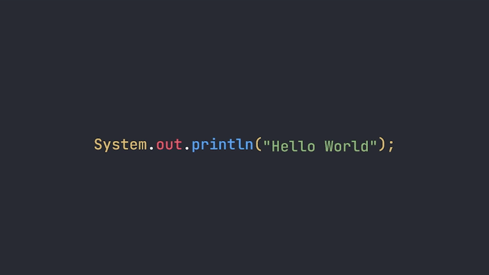

# Hello World Mai Lah
My own way of saying 'Hello World' with React + TailwindCSS Framework
   
  ↪ Console : C++
   
  ↪ Console : C#
   
  ↪ Console : Java
   
  ↪ Console : JavaScript
   
  ↪ Console : PHP
   
  ↪ Console : Python
   
  

  

